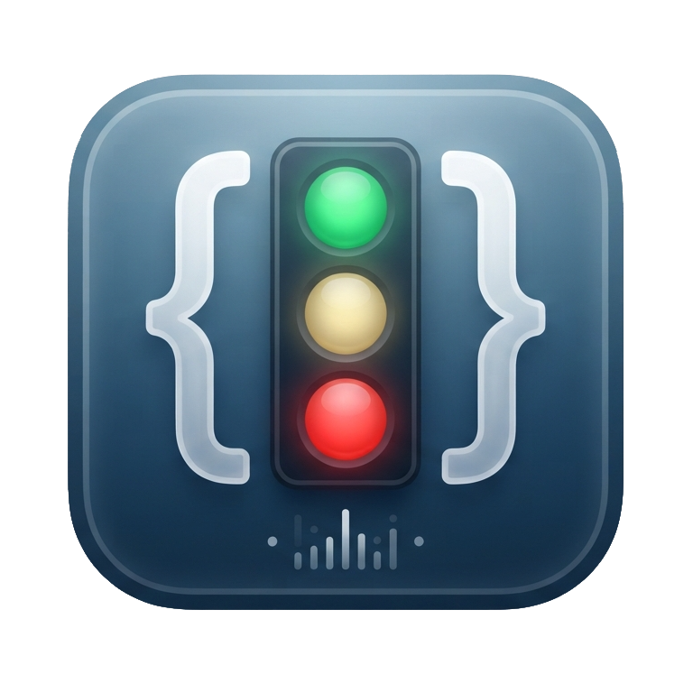
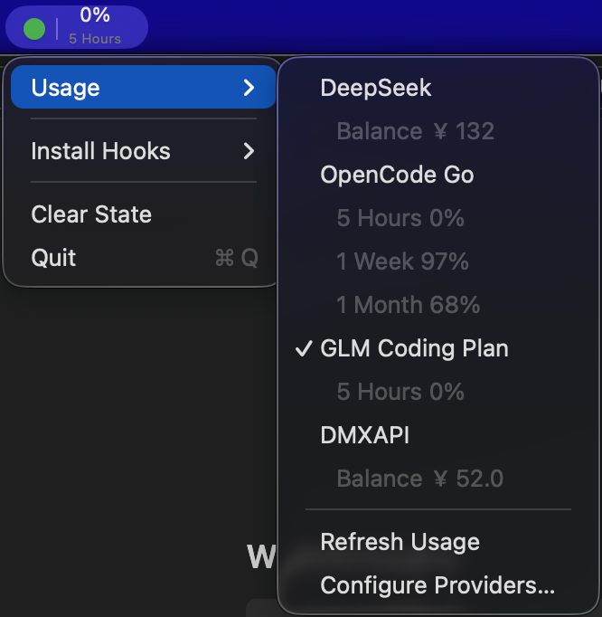
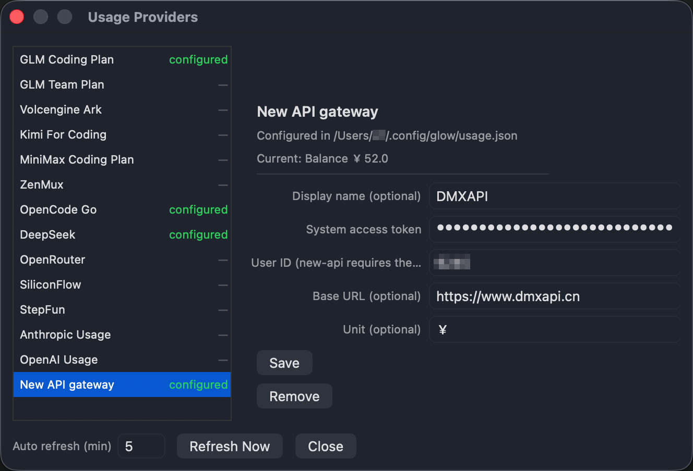
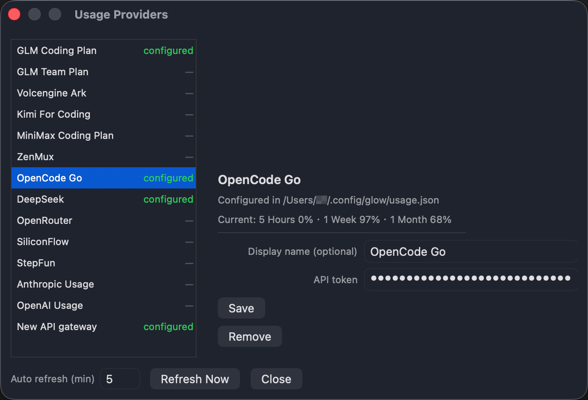
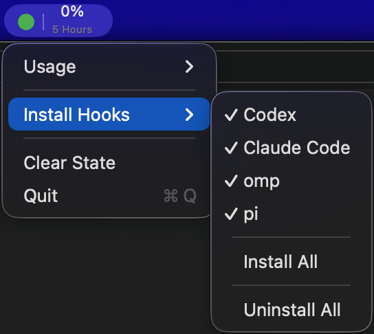

# Glow

<p align="center">
  
</p>

<p align="center"><em>AI 编程助手的菜单栏环境状态面板——给 Agent 一盏看得见的状态灯。</em></p>

Glow 把 macOS 菜单栏变成 AI 编程助手的环境状态面板。Codex、Claude Code 或其他本地 Agent 开始工作、请求权限、遇到阻塞时，菜单栏图标会同步变化。在状态灯之外，菜单栏同时呈现模型 provider 的用量状态——配额窗口、余额、轮询节奏全部可配。

它的目标不是炫技，而是让 AI Agent 从屏幕里的文字流，变成一眼就能感知的工作状态。

## 为什么做这个

AI 编程助手越来越能自己跑命令、改文件、开子任务，但它的状态通常还困在终端或聊天窗口里。于是你要么反复切回去看，打断自己的注意力；要么忘了它正在等权限、等你读结果、或者已经失败。

Glow 给 Agent 一个在菜单栏里的可见存在：

- 绿灯：没事，继续你的事。
- 绿灯闪烁：Agent 正在工作。
- 黄闪：Agent 明确需要你看一眼或继续。
- 红闪：需要马上处理，通常是权限、阻塞或失败。

## 灯语

灯语刻意保持简单，并且状态会持续显示。你不需要记复杂动画，只要看当前灯效。完整灯效语言见 [docs/LAMP_LANGUAGE.md](docs/LAMP_LANGUAGE.md)。

| 灯效 | Agent 状态 | 你该做什么 |
| --- | --- | --- |
| 绿灯常亮 | 空闲 | 不用管 |
| 绿灯闪烁 | 正在思考、跑工具、改文件或测试 | 等它跑 |
| 黄灯闪烁 | 明确需要你读结果或继续 | 有空看一眼 |
| 红灯闪烁 | 需要权限、阻塞或失败 | 马上处理 |
| 全灭 | 手动清除 | 不用管 |

## 功能亮点

- macOS 菜单栏应用：信号灯 + iStat 式两行用量徽章（值在上、标签在下）。
- 支持 Codex hook。
- 支持 Claude Code hook。
- 支持 omp / pi（安装 hook 扩展模板，自动联动状态灯）。
- 支持多个 Agent 会话并发时的状态聚合。
- 红灯/黄灯告警不会被另一个会话的工作态覆盖。
- Provider 用量显示：14 个 provider（套餐配额 / 余额 / 官方 usage API），徽章可钉选任意 provider。
- 支持通过 launchd 开机自启。

## 快速开始

```bash
./scripts/build.sh                       # 构建 macOS 菜单栏应用（仓库根 SwiftPM 包）
open .build/Glow.app                      # 启动
```

应用在菜单栏运行，右键点击可查看详情或退出。首次启动会自动配置 launchd 开机自启。

### Usage Providers（provider 用量）

菜单栏徽章除了信号灯，还可以显示模型 provider 的用量。支持的 provider：

| 类型 | type | 凭据 |
| --- | --- | --- |
| GLM Coding Plan | `glm` | token |
| GLM Team Plan | `zhipu-team` | token + organization + project |
| Volcengine Ark | `volcengine` | AccessKey + Secret（控制面签名） |
| Kimi For Coding / MiniMax / ZenMux / OpenCode Go | `kimi` / `minimax` / `zenmux` / `opencode-go` | token |
| DeepSeek / OpenRouter / SiliconFlow / StepFun | `deepseek` / `openrouter` / `siliconflow` / `stepfun` | token |
| Anthropic / OpenAI 官方 usage | `anthropic` / `openai` | 组织 admin key |
| New API / One API 网关 | `new-api` | 访问令牌 + user ID + Base URL |

> 按"用量付费"计费的 provider 显示余额（可自定义货币符号），订阅套餐类显示配额窗口百分比（5 Hours / 1 Week / 1 Month）。

<p align="center">
  
</p>

配置方式（二选一）：

```bash
APP=.build/Glow.app/Contents/MacOS/Glow

$APP usage-config list             # 查看全部 provider 与配置状态
$APP usage-config add deepseek     # 交互式添加（提示输入 key）
$APP usage-config remove deepseek  # 移除
```

或菜单栏图标 → Usage → **Configure Providers…** 打开设置窗口，选中类型填写凭据保存。保存后立即刷新，无需重启。

- 徽章钉选：Usage 菜单里点击 provider 名称（打 ✓）即把徽章钉到该 provider；再点取消，回到默认顺序。
- 自动刷新间隔：设置窗口底部的 "Auto refresh (min)"。
- 所有 provider 都来自显式配置（`~/.config/glow/usage.json`，0600），不会被 agent 配置隐式启用。

<p align="center">
  
</p>

### Hook 安装

安装或修复本地 hook 最简单的方式是内置向导：

```bash
# CLI 二进制（app bundle 内）
APP=.build/Glow.app/Contents/MacOS/Glow

$APP install-hooks                    # 交互式选择
$APP install-hooks --all -y           # 安装全部 Agent
$APP install-hooks --agent codex --agent claude-code -y
$APP install-hooks --agent omp --agent pi -y
$APP uninstall-hooks --all -y         # 卸载全部 Agent 的 Glow hooks（对称逆操作，幂等）
```

也可以右键菜单栏图标 → "Install Hooks" 子菜单，按 Agent 分别安装（Codex / Claude Code / omp / pi）。向导会识别已支持的 Agent，检查当前 hook 文件，写入前创建带时间戳的备份，并且只安装 Glow 自己的 hook 条目，保留同一事件下已有的其它 hook。

卸载用 `uninstall-hooks`（参数与 install 一致，同样幂等、带时间戳备份、保留第三方 hook）：`$APP uninstall-hooks --all -y`，也可用 `--agent` 指定单个 Agent 或 `--dry-run` 预览。

omp 与 pi 的安装方式不同：它们没有 JSON 配置，安装会把内置的 hook 扩展模板（`Resources/glow-hook-template.ts`）复制到用户级扩展目录（`~/.omp/agent/extensions/` 与 `~/.pi/agent/extensions/`），之后启动 agent 即自动加载、零参数联动状态灯。

<p align="center">
  
</p>

菜单里的单个 Agent 是开关式：未安装点击即装（打 ✓），已安装点击即卸（去 ✓）；✓ 状态在每次展开菜单时重新检查。

## Codex 集成

Codex hook 通过事件名调用：

```bash
$APP codex-hook UserPromptSubmit
$APP codex-hook PreToolUse
$APP codex-hook PermissionRequest
$APP codex-hook Stop
```

推荐映射：

| Codex 事件 | 灯效行为 |
| --- | --- |
| `SessionStart` | 绿灯空闲 |
| `UserPromptSubmit` | 绿灯闪烁（工作中） |
| `PreToolUse` | 绿灯闪烁（工作中） |
| `PostToolUse` | 绿灯闪烁（工作中） |
| `PermissionRequest` | 黄灯闪烁 |
| `Stop` | 清理普通工作态 |
| `SessionEnd` | 清理该会话记录，恢复当前聚合状态 |

完整 `~/.codex/hooks.json` 示例见 [docs/LAMP_LANGUAGE.md](docs/LAMP_LANGUAGE.md)。

## Claude Code 集成

Claude Code 通过 stdin 传入 JSON hook 数据，不需要额外参数：

```bash
echo '{"event":"PreToolUse","session_id":"demo"}' | $APP claude-code-hook
echo '{"event":"PermissionRequest","session_id":"demo"}' | $APP claude-code-hook
echo '{"event":"Notification","session_id":"demo"}' | $APP claude-code-hook
```

支持的 Claude Code 事件包括：

| Claude Code 事件 | 灯效行为 |
| --- | --- |
| `SessionStart` | 绿灯空闲 |
| `UserPromptSubmit` | 绿灯闪烁（工作中） |
| `PreToolUse` | 绿灯闪烁（工作中） |
| `PostToolUse` | 绿灯闪烁（工作中） |
| `PostToolUseFailure` | 红灯闪烁 |
| `Notification` | 黄灯闪烁 |
| `PermissionRequest` | 黄灯闪烁 |
| `Stop` | 清理普通工作态 |
| `SessionEnd` | 清理该会话记录，恢复当前聚合状态 |

完整 `~/.claude/settings.json` 示例见 [docs/LAMP_LANGUAGE.md](docs/LAMP_LANGUAGE.md)。

## Nightly 构建

推送代码变更（`Sources/`、`Tests/`、`Resources/`、`scripts/`、`.githooks/`、`Package.swift`）时，`.githooks/pre-push` 会自动重新打包并上传到 GitHub 的 `nightly` release（固定名称，资产 `Glow-arm64.pkg` / `Glow-x86_64.pkg` + `sha256` 覆盖更新；仅文档变更的推送会跳过）。

启用（一次性）：

```bash
git config core.hooksPath .githooks
```

手动打包：`bash scripts/package.sh`

## 多会话行为

运行时会记录每个 Agent 会话的最新状态，并把最高优先级状态显示到菜单栏：

```text
红灯闪烁 > 黄灯闪烁 > 工作循环 > 绿灯常亮
```

因此，一个会话正在等待权限时，即使另一个会话开始工作，红灯也不会被覆盖。普通 `Stop` 只会清掉非紧急的工作态，不会误清除已有红灯告警。

当某个已记录的会话结束时，运行时会清理该会话的记录并重新计算聚合状态：如果其它会话还在运行，灯立即切换到剩余会话的聚合状态；如果所有会话都结束了，最终回到绿灯常亮。红灯或黄灯告警不受会话结束影响。

## Roadmap

见 [docs/ROADMAP.md](docs/ROADMAP.md)：M1 状态灯、M2 provider-usage 已完成（14 个 provider、配置 GUI、徽章钉选）；下一步候选见 ROADMAP。

## 项目状态

这是一个可扩展的 AI 编程伴侣项目。你可以很容易地 fork 并扩展它：

- 把更多 Agent 系统映射到同一套灯语。
- 扩展灯语，增加新的信号类型。
- 自定义菜单栏外观或用量展示。

如果 AI Agent 已经成了你的工作流的一部分，给它一盏状态灯。

## Attribution

Glow derived from [vibecoding-signal-light](https://github.com/starlight36/vibecoding-signal-light) by starlight36 (MIT)。灯语体系与 hook 契约源自该项目。

Usage Monitor 的 provider 矩阵与端点口径参考 [cc-switch](https://github.com/farion1231/cc-switch) by farion1231 (MIT)。
