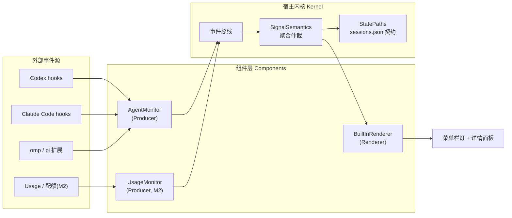

# Glow 插件开发指南（骨架版）

> 本文档是 Glow 组件化的架构说明与插件开发指南。当前为 **M1 骨架版**：
> 描述真实目录布局、参考实现（AgentMonitor / BuiltInRenderer）的行为契约，
> 以及 M2 将落地的协议草案。接口在 M2 随 UsageMonitor 落地时可能微调。

## 1. 架构总览

Glow 采用 **三层组件模型**：所有能力都是组件（Component），按数据流方向分为
Producer（产生事件）、Processor（转换/升级事件）、Renderer（消费事件渲染）。
Kernel 是宿主内核，负责事件总线、聚合仲裁与文件契约，组件之间不直接互调。



### 职责表

| 角色 | 职责 | 约束 |
|---|---|---|
| **Producer** | 感知外部事件（agent hook、轮询、系统状态），把事件翻译成标准信号写入事件总线 | **禁止碰 UI**；禁止消费其他组件的信号 |
| **Processor** | 对事件做转换/升级（去重、聚合、衍生新事件）（M2 起引入） | 只读入事件、只写事件，不持久化 UI 状态 |
| **Renderer** | 消费信号渲染界面（菜单栏图标、详情面板、菜单项） | **禁止产生事件**；禁止直写 sessions.json |
| **Kernel** | 事件总线、`SignalSemantics` 聚合仲裁、`StatePaths` 文件契约、组件生命周期（注册/启动/停止） | 不含业务语义，只做分发与仲裁 |

### Kernel 的四项职责

1. **事件总线**：组件通过总线发布 `(sessionKey, signal)` 事件，Renderer 订阅聚合结果。
   M1 中总线尚未独立成型——Producer 直接调用 `SessionStore.applySessionSignal`，
   Renderer 通过 `SessionPoller` 轮询读取；M2 将把这条链路收拢为显式总线。
2. **聚合仲裁**：`SignalSemantics`（`Kernel/SignalDefinition.swift`）定义信号分类集合，
   `aggregateSignal(from:)` 按优先级选出聚合信号，多会话紧急信号永不被普通活动掩盖。
3. **文件契约**：`StatePaths` 是磁盘路径唯一事实源（`GLOW_STATE_DIR` 可覆盖，
   默认 `/private/tmp/glow`），CLI 与 GUI 通过 `sessions.json` 交换状态，无 IPC。
4. **组件生命周期**：`AppDelegate` 创建 poller 与 StatusBarController（M1 手工装配；
   M2 起组件注册进 Kernel，由 Kernel 统一 start/stop）。

## 2. 当前目录结构说明

```
Sources/GlowCore/
├── Kernel/                        # 宿主内核
│   ├── StatePaths.swift           # 磁盘路径唯一事实源（GLOW_STATE_DIR 覆盖）
│   ├── SessionState.swift         # sessions.json 的 Codable 模型（SessionFile/SessionEntry）
│   ├── SignalDefinition.swift     # 11 个信号定义、SignalSemantics 分类集、aggregateSignal()
│   ├── SessionStore.swift         # sessions.json 读写 + flock 锁 + TTL 清理 + 聚合快照
│   ├── LaunchdManager.swift       # 登录自启 launchd plist 安装/卸载
│   └── AppDelegate.swift          # PID 文件、poller 初始化、菜单栏装配（GUI 入口装配层）
└── Components/
    ├── AgentMonitor/              # Producer：agent 状态监控
    │   ├── CodexHookAdapter.swift       # Codex 生命周期事件 → 信号（深度失败探测）
    │   ├── ClaudeCodeHookAdapter.swift  # Claude Code 事件 → 信号（stop_reason、子代理、通知）
    │   ├── HookSupport.swift            # HookInput / SIGNAL_NAMES / argv 事件解析 / 落盘+上报尾部
    │   ├── HookAgent.swift              # Agent 枚举（4 个 agent）、AgentStatus、事件表与配置路径
    │   ├── HookConfigMerge.swift        # JSON hook 配置纯函数合并/替换/识别器（isGlowCommand）
    │   ├── HookInstaller.swift          # 安装/卸载/巡检（install/uninstall + 备份 + 幂等）
    │   ├── InstallHooksCLI.swift        # install-hooks / uninstall-hooks CLI（共享参数解析）
    │   ├── CLIDispatch.swift            # 单二进制双模式：子命令分发，无子命令则启动 GUI
    │   └── SessionPoller.swift          # 500ms Combine 轮询 sessions.json（Combine 定时器）
    ├── UsageMonitor/               # Producer：provider 用量监控（M2）
    │   ├── UsageMonitor.swift          # 组件宿主：轮询 + 落盘 + 菜单贡献（实现 GlowComponent/MenuContributor）
    │   ├── UsageCredentials.swift      # 凭据发现（claude env / opencode auth / 显式配置）
    │   ├── UsageHTTP.swift             # JSON GET 小封装 + UsageParseError
    │   ├── UsageBadge.swift            # badge/菜单文本格式化
    │   ├── CodingPlanProviders.swift   # GLM/Kimi/MiniMax/ZenMux/OpenCode Go 配额
    │   ├── BalanceProviders.swift      # DeepSeek/OpenRouter/SiliconFlow/StepFun 余额
    │   └── OfficialUsageProviders.swift# Anthropic/OpenAI 官方 usage API
    └── BuiltInRenderer/           # Renderer：菜单栏 + 详情面板
        ├── StatusBarController.swift    # NSStatusItem 灯色图标 + badge 文本 + 闪烁动画 + 右键菜单
        ├── DetailPanelWindow.swift      # 浮动 NSPanel 详情窗（含 Usage 区块）
        └── TrafficLightView.swift       # 自绘红/黄/绿三色交通灯 NSView
```

同一 SPM target（`Sources/GlowCore`）内部移动无需改 import；`Package.swift`
的 target path 为整个目录，亦无需改动。

## 3. 现有组件功能说明（参考实现）

### 3.1 AgentMonitor（Producer）

#### 四个子适配器

| 子适配器 | 接入方式 | 事件表 |
|---|---|---|
| Codex | `hooks.json` JSON 注册（`~/.codex/hooks.json`） | 7 项（见下表） |
| Claude Code | `settings.json` JSON 注册（`~/.claude/settings.json`） | 12 项（见下表） |
| omp | TS 扩展模板复制到 `~/.omp/agent/extensions/observability-glow.ts` | 模板内转发全部事件 |
| pi | TS 扩展模板复制到 `~/.pi/agent/extensions/observability-glow.ts` | 模板内转发全部事件 |

**Codex 事件 → 信号映射（7 项）**

| 事件 | 信号 | 含义 |
|---|---|---|
| `SessionStart` | `session_start` | 会话开始 |
| `UserPromptSubmit` | `thinking` | 收到任务，思考中 |
| `PreToolUse` | `working` | 即将执行工具 |
| `PostToolUse` | `tool_done` | 工具调用完成 |
| `PermissionRequest` | `permission` | 请求授权（timeout 10s） |
| `Stop` | `turn_end` | 一轮对话结束 |
| `SessionEnd` | `session_end` | 会话结束 |

**Claude Code 事件 → 信号映射（12 项）**

| 事件 | 信号 | 备注 |
|---|---|---|
| `SessionStart` | `session_start` | |
| `UserPromptSubmit` | `thinking` | |
| `PreToolUse` | `working` | |
| `PostToolUse` | `tool_done` | |
| `PostToolUseFailure` | `blocked` | 工具失败直接红灯 |
| `PreCompact` | `working` | |
| `SubagentStart` | `working` | |
| `SubagentStop` | `tool_done` | |
| `PermissionRequest` | `permission` | timeout 10s |
| `Notification` | `attention` | 需要用户注意 |
| `Stop` | `turn_end` | `stop_reason` 为 `max_tokens`/`error` 时升级为 `blocked` |
| `SessionEnd` | `session_end` | |

所有 hook 注册项均带 `timeout`（普通 5s，PermissionRequest 10s）。

**omp / pi 模板转发**：bundle 内 `glow-hook-template.ts` 探测 Glow 二进制
（`GLOW_BIN` 环境变量 → 常见安装位置），把 agent 内部事件转发给 `glow` CLI，
与 JSON 型 agent 最终走同一条 `applySessionSignal` 落盘链路。

#### 信号判定优先级（chooseSignal）

1. payload 显式信号字段（`signal` / `signal_name` / `lamp_signal`）；
2. `status` / `state` 字段（合法信号名直取；`error`/`failed`/`failure`/`exception` 映射 `blocked`）；
3. **深度失败探测**：递归搜索 payload 结构中的错误标记（error 状态、非零
   `exit_status`、tool_error 等）→ `blocked`（仅 Codex 适配器）；
4. 事件名映射表兜底；未知事件 → `attention`。

#### sessionKey 提取优先级

1. payload 显式 ID：`session_id` / `conversation_id` / `thread_id` / `chat_id` / `codex_session_id`
   （Codex 适配器额外做嵌套结构递归查找）；
2. 环境变量：`CODEX_SESSION_ID` 系列（Codex）、`CLAUDE_CODE_SESSION_ID` / `CLAUDE_SESSION_ID`（Claude Code）；
3. payload `cwd` 回退：`cwd:<路径>`；
4. 兜底 `"global"`（Claude Code）。

#### sessions.json 契约

```json
{
  "sessions": {
    "<sessionKey>": { "signal": "working", "updated_at": 1730000000.123 }
  }
}
```

- 路径：`StatePaths.sessionFile`（`$GLOW_STATE_DIR/sessions.json`，默认 `/private/tmp/glow`）；
- 写入走 `flock(LOCK_EX)` 互斥（`state.lock`），并发 hook 进程安全；
- 读取容忍文件缺失/损坏（损坏时 trace 到 stderr，视为空）；
- TTL 清理：`GLOW_SESSION_TTL_SECONDS`（默认 86400），读/写时顺手剪枝过期会话；
- 生命周期规则：`session_end`/`off` 删除该会话键；`turn_end` 删除该会话键，
  除非当前信号处于保留集 `{permission, blocked}`（授权/阻塞提醒不因轮次结束丢失）。

#### 多会话聚合优先级

`aggregateSignal(from:)`：

```
blocked（红） > permission（黄） > attention / done（黄） > thinking / working / tool_done（working） > idle
```

紧急信号（红/黄）永不被普通工作信号掩盖。

#### install-hooks / uninstall-hooks 双向幂等

- **install**：JSON 型把 `hookCommand(for:)` 合并进各事件组（替换旧 Glow 条目，
  保留第三方条目）；模板型复制 TS 模板（内容一致则跳过）。变更前备份
  `.bak-glow-install-<时间戳>`。
- **uninstall**（install 的对称逆操作）：
  - JSON 型：从 `agent.events` 对应事件中移除所有 Glow 识别器（`isGlowCommand`，
    含历史兼容子串）命中的条目 → 组内 hooks 空则删组 → 事件数组空则删事件键 →
    顶层 `hooks` 键保守保留（即使为空字典）；无效 JSON 直接 throw，绝不半改；
    无变更时静默返回（幂等 no-op）。变更前备份 `.bak-glow-uninstall-<时间戳>`。
  - 模板型：删除目标文件（存在才删，先备份）；顺带清理同目录旧名残留
    `observability-signal-light.ts`（同样备份）。
  - 状态报告 `uninstallAgentAndReport`：message 语义为「卸载前 installed →
    `uninstalled`；本来就没装 → `not installed`」（以卸载前 inspect 为准）。
- **第三方 hook 保全**：识别器只认领 Glow 形态命令（`Glow codex-hook` /
  `claude-code-hook`、历史 `signal-light` / `SignalLightApp` 子串、以及任何
  调用本 CLI 子命令的 token 形态），其余条目原样保留。

#### CLI 子命令表

| 子命令 | 说明 | 退出码 |
|---|---|---|
| `codex-hook [Event]` | Codex hook 入口（stdin JSON payload） | 0 成功 / 1 落盘失败 |
| `claude-code-hook [Event]` | Claude Code hook 入口 | 同上 |
| `install-hooks [--all\|-y\|--agent X\|-a X\|--dry-run]` | 安装/修复 hooks；无参交互式选择 | 0 成功 / 2 不支持的 agent |
| `uninstall-hooks [--all\|-y\|--agent X\|-a X\|--dry-run]` | 卸载 hooks（与 install 参数解析一致、输出镜像：`Would uninstall X` / `Uninstalled X: <message>`） | 0 成功 / 2 不支持的 agent |
| `status` | 打印聚合状态 + 会话表（JSON） | 0 / 1 |
| `clear-state` | 清空 sessions.json | 0 / 1 |
| 无子命令 | 启动 GUI（菜单栏） | — |

### 3.2 BuiltInRenderer（Renderer）

- **菜单栏灯色图标**（`StatusBarController`）：`NSStatusItem` 绘制当前聚合信号
  对应颜色。闪烁语义：`SignalDefinition.isRepeating == true` 的信号（thinking /
  working / tool_done 绿闪、attention / permission / done 黄闪、blocked 红闪）
  周期性闪烁提醒；非重复信号常亮（idle 绿灯常亮、session_start / session_end /
  off 不闪）。
- **详情面板**（`DetailPanelWindow` + `TrafficLightView`）：浮动 NSPanel，用
  自绘红/黄/绿交通灯展示每个会话的信号与更新时间，聚合状态置顶。
- **菜单结构**：

  ```
  Show Details            (⌘D)
  ─────────────────────────────
  Install Hooks ▸         Codex / Claude Code / omp / pi
                          ─────────
                          Install All
                          ─────────
                          Uninstall All
  ─────────────────────────────
  Clear State
  Quit                    (⌘Q)
  ```

  Install/Uninstall All 对全部四个 agent 逐一执行并以 alert 汇总各 agent 的
  message（install 后的 message 为 `installed` / `install failed: …`，
  uninstall 后为 `uninstalled` / `not installed`）。

## 4. 组件协议（M2 落地于 `Kernel/GlowComponent.swift`）

M2 随 UsageMonitor 落地了组件协议。当前所有组件同处 `GlowCore` target，
协议为 internal；未来拆分插件 target 时再转 public。以 `Kernel/` 内最终代码为准：

```swift
/// 基协议：由宿主（AppDelegate）装配并驱动生命周期。
protocol GlowComponent: AnyObject {
    /// 组件唯一标识（日志与菜单接线用）。
    var id: String { get }
    /// 装配完成后调用一次；组件在此启动轮询/监听。
    func start()
    /// 退出前调用；组件在此释放资源。
    func stop()
}

/// Usage Producer：生产 provider 用量快照。
/// 禁碰 UI、禁直写状态文件——只 fetch 并上报，由持有方落盘。
protocol UsageProducer: AnyObject {
    /// 稳定 provider key，同时是 usage.json 字典键（如 `glm`）。
    var providerKey: String { get }
    /// 菜单/面板显示名。
    var displayName: String { get }
    /// 拉取当前用量条目。网络/凭据/响应变形一律 throw。
    func fetch() async throws -> [UsageItem]
}

/// 菜单贡献能力：向菜单栏右键菜单追加菜单项。
protocol MenuContributor: AnyObject {
    /// 宿主负责在前后加分隔线。
    func menuItems() -> [NSMenuItem]
}
```

- `SignalProducer`（产生 `(sessionKey, signal)` 事件的 agent 事件类组件）
  与 `PanelContributor`（详情面板区块视图）仍为草案，待后续组件落地时淬炼。
- UsageMonitor 是第一个实现 `GlowComponent + MenuContributor` 的组件；
  `UsageProducer` 的实现是各 provider 类（`GLMUsageProvider` 等）。

### usage.json 契约

```json
{
  "order": ["glm", "deepseek"],
  "providers": {
    "<providerKey>": {
      "display_name": "GLM Coding Plan",
      "updated_at": 1730000000.123,
      "status": "ok",
      "error": null,
      "items": [
        { "label": "5h window", "used_percent": 42.5, "remaining": null,
          "total": null, "unit": null, "resets_at": "2026-09-02T14:00:00Z" }
      ]
    }
  }
}
```

- 路径：`StatePaths.usageFile`（`$GLOW_STATE_DIR/usage.json`，默认 `/private/tmp/glow`）；
- 写入走 `StateFileLock`（与 sessions.json 共用 `state.lock`）互斥；
- 读取容忍文件缺失/损坏（损坏时 trace 到 stderr，视为空）；
- `order` 决定 badge 与菜单的 provider 优先级（缺省时按键名排序）；
- `status == "error"` 时 `error` 携带可读原因，`items` 保留上次成功值；
- `items[0]` 是该 provider 的 badge 候选；`used_percent` 0-100 已用口径。

### 凭据发现（`UsageConfig`）

三路来源，后者覆盖前者（按 providerKey 去重）：
1. `~/.claude/settings.json` 的 `env` 块：`ANTHROPIC_BASE_URL` +
   `ANTHROPIC_AUTH_TOKEN`，按域名识别 coding-plan 平台
   （bigmodel.cn / api.z.ai → GLM，api.kimi.com/coding → Kimi，
   api.minimaxi.com → MiniMax，zenmux → ZenMux，opencode.ai/zen/go → OpenCode Go，
   api.anthropic.com → Anthropic 官方；未知中转忽略）；
2. `~/.local/share/opencode/auth.json`（当前识别 `zhipuai-coding-plan`）；
3. 显式配置 `~/.config/glow/usage.json`：
   `{"providers": [{"type": "glm", "token": "...", "base_url": "..."}]}`，
   type 取值：glm / kimi / minimax / zenmux / opencode-go / deepseek /
   openrouter / siliconflow / stepfun / anthropic / openai。

轮询间隔 `GLOW_USAGE_POLL_SECONDS`（默认 300，下限 10）。Anthropic/OpenAI
官方 usage API 需要组织 admin key，普通 key 会得到 401/403——错误原样显示在
菜单里，不做特判。

CLI 子命令 `usage` 打印 usage.json 全文（JSON）。

## 5. 开发路线（M2 后本指南补齐）

本骨架版覆盖架构与现状；以下内容在 M2 组件协议落地后补充：

1. **50 行示例插件教程**：从零写一个最小 `SignalProducer`（如 git 长任务监控），
   注册进 Kernel → 产生事件 → 菜单栏亮灯的完整步骤。
2. **AI prompt 模板**：一段可直接投喂 AI 的提示词（「把本指南 + 协议签名发给
   AI，生成符合约定的插件骨架」），降低第三方插件的上手成本。
3. **组件测试约定**：Producer 测试只验证事件→信号映射与 sessionKey 提取
   （注入临时 `GLOW_HOME` / `GLOW_STATE_DIR`，禁止写真实 home）；Renderer
   测试验证聚合结果到 UI 状态的映射；统一使用 Swift Testing。
